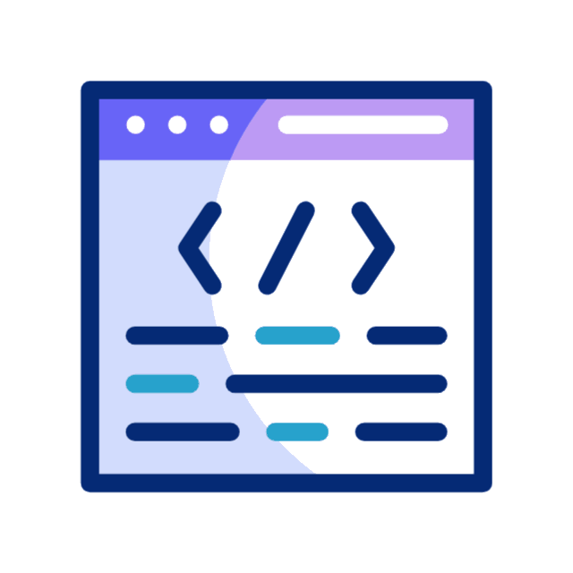

<p align="center">
  <a href="https://git.io/typing-svg">
    
  </a>
  
</p>

<table border="0">
<tr>
<td width="83%">
Hey there! I'm Medha, a passionate BTech CSE student with a deep interest in AI, machine learning, and the ever-evolving world of technology. I'm on a journey to solve real-world problems with code, constantly exploring new tech trends and innovations. Whether it's through programming or robotics, I love pushing the boundaries and creating solutions that make a difference.
</td>
<td width="17%">

</td>
</tr>
</table>

<!-- Profile Visit Badge -->
<p align="center">
  <a href="https://github.com/medss19">
    
  </a>
</p>

---

```text
🎯 Journey & Interests:
├── 🎓 Education
│   └── BTech in Computer Science (AI/ML) @ Bennett University
│
├── 💼 Experience
│   ├── Cloud/DevOps Engineer Intern @ Kloudwise
│   └── Machine Learning Intern @ BrainAI
│
├── 🏆 Achievements
│   └── Hackathon Winner - AI-Driven Fraud Detection
│
├── 📚 Learning Focus
│   ├── Advanced AI/ML Models
│   ├── Deep Learning
│   └── Cloud Computing
│
└── 💡 Interests
    ├── Robotics 🤖 & AI/ML 🔍
    ├── Data Science 📊 & Tech Innovations 💻
    └── Competitive Programming 🏆
```

---

<h2 align="left">
  
  Languages and Tools
</h2>

<br>

<p align="left">
  
  
  
  
  
  
  
  
  
  
  
  
  
  
</p>

---

<h2 align="left">
  
  Connect with me
</h2>

<br>

<p align="left">
  <a href="https://twitter.com/medsss19" target="blank"></a>
  <a href="https://www.linkedin.com/in/medha-agarwal-01b33725a/" target="blank"></a>
  <a href="https://medium.com/@medhaagarwal49" target="blank"></a>
  <a href="https://www.leetcode.com/medsss19" target="blank"></a>
</p>

---

<h2 align="left">
  
  My GitHub Stats
</h2>

<br>

<div align="center">
  
</div>

<br>

<div align="center">
  
  
</div>
